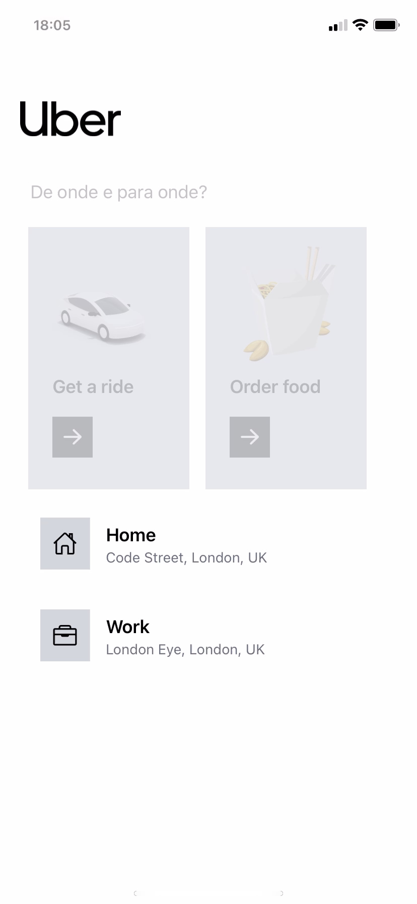
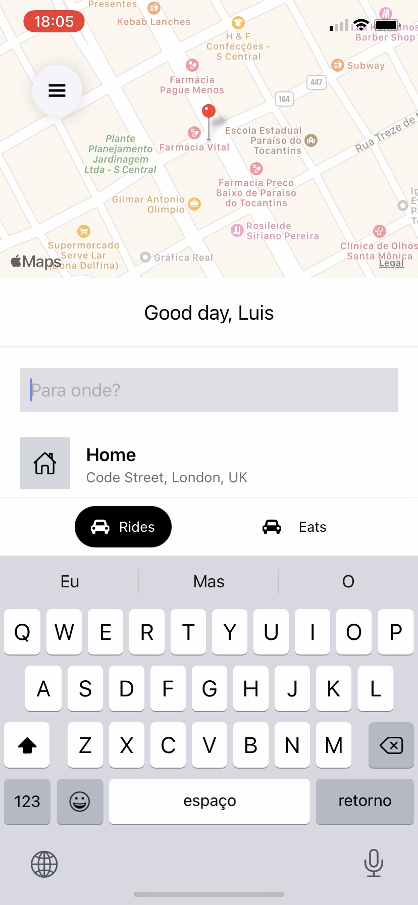
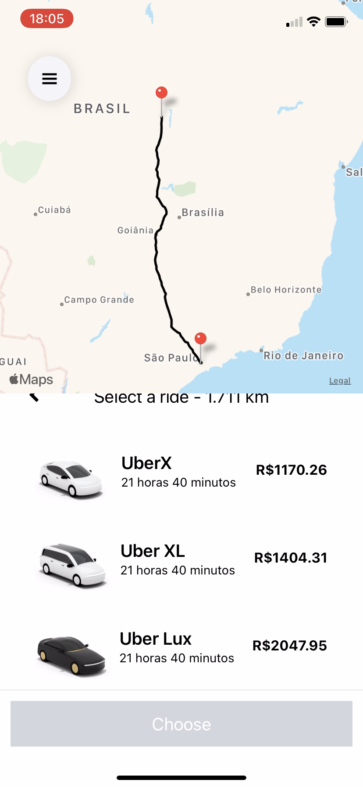

# uber_clone

<h1 align="center">
    Uber Clone
</h1>
 

Clone realizado para estudos com mapas no react native

<h4 align="center">
  Uber Clone
</h4>

Telas do App

    
    
    

## :rocket: Tecnologias

Esse projeto foi desenvolvido com as seguintes tecnologias:

- [React Native](https://facebook.github.io/react-native/)

## 💻 Projeto

Repositório não contem a pasta .expo-shared
Para usar o app vc Precisa trocar a palavra API_KEY localizada em algumas pastas do app, para uma API_KEY real do Google Cloud Platform

